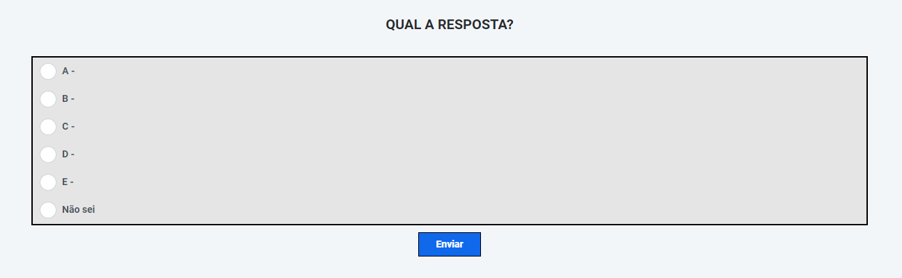

<div align="center">

# OutSystems Projects

</div>

## 1. Option Count App

### This is a responsive voting site made using the plataform OutSystems intended for use in classrooms available for mobile and desktop.

### The functions of this website include:

### ```Teacher's area:```
#### **Test here the [Professor Area](https://personal-uzkb4ysu.outsystemscloud.com/App/Professor)**
- [x] Graph with the percentage of votes measured and if you hover the mouse over it, the quantity in number appears.

- [x] The number of votes counted
- [x] Update chart button
- [x] Count reset button (clear)
- [x] Switch to enable graphics for students
- [x] Dropdown to change option captions (default is nothing)


### ```Student area:```
#### **Test here the [Student Area](https://personal-uzkb4ysu.outsystemscloud.com/App/Questionario)**
- [x] Submit poll
Response graph (if the teacher enables it for students to view)

- [x] If you have any suggestions/improvements/corrections for my website, please contact me via email or create an issue with your suggestion! 





